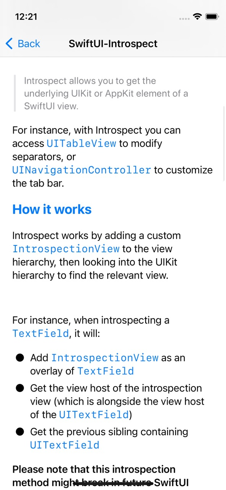

[](https://swiftpackageindex.com/shaps80/MarkdownText)

# MarkdownText

A native SwiftUI view for rendering Markdown text in an iOS or macOS app.

## Sponsor

Building useful libraries like these, takes time away from my family. I build these tools in my spare time because I feel its important to give back to the community. Please consider [Sponsoring](https://github.com/sponsors/shaps80) me as it helps keep me working on useful libraries like these 😬

You can also give me a follow and a 'thanks' anytime.

[](http://twitter.com/shaps)

## Preview



## Supported Markdown

- Headings
- Paragraphs
- Quotes
- Inline formatting
    - Strong/Bold
    - Emphasis/Italic
    - Strikethrough
    - Code
    - Links (non interactive only)
- Lists
    - Ordered
    - Unordered
    - Checklist (GitHub style)
- Thematic Breaks
- Code Blocks
- Images
    - A full backport of `AsyncImage` is included
    
## Features

**Style APIs**

Adopting the familiar SwiftUI style-based APIs, you can customize the appearance of almost all markdown elements either individually or composed.

```swift
struct CustomUnorderedBullets: UnorderedListBulletMarkdownStyle {
    func makeBody(configuration: Configuration) -> some View {
        // you can also provide a completely new View if preferred 👍
        configuration.label
            .foregroundColor(.blue)
    }
}
```

You can even customize animations since the library is composed of 100% SwiftUI elements only.

```swift
struct ScaledImageStyle: ImageMarkdownStyle {
    // image will scale up as its loaded, moving content out of the way
    func makeBody(configuration: Configuration) -> some View {
        configuration.label
            .transition(.scale)
    }
}
```

Modifiers for styling and visibility can also be placed anywhere in your SwiftUI hierarchy, just as you'd expect:

```
NavigationView {
    MarkdownText(markdown)
}
// Styling
.markdownQuoteStyle(.inset)
.markdownOrderedListBulletStyle(.tinted)
.markdownImageStyle(.animated)

// Visibility
.markdownCode(.visible)
.markdownThematicBreak(.hidden)
```

## Demo App

A [MarkdownText Demo](https://github.com/shaps80/MarkdownTextDemo) is also available to better showcase the libraries capabilities.

## Usage

Using the view couldn't be easier:

```swift
MarkdownText("Some **markdown** text")
LazyMarkdownText(someMassiveMarkdownText)
```

There's even a `LazyMarkdownText` view that loads its view's lazily for those cases where you need improved scrolling and loading performance.

## Installation

You can install manually (by copying the files in the `Sources` directory) or using Swift Package Manager (**preferred**)

To install using Swift Package Manager, add this to the `dependencies` section of your `Package.swift` file:

`.package(url: "https://github.com/shaps80/MarkdownText.git", .upToNextMinor(from: "1.0.0"))`
